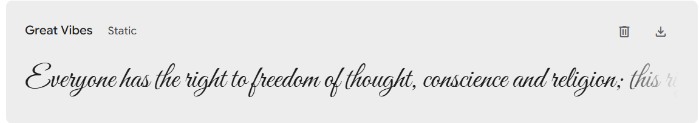
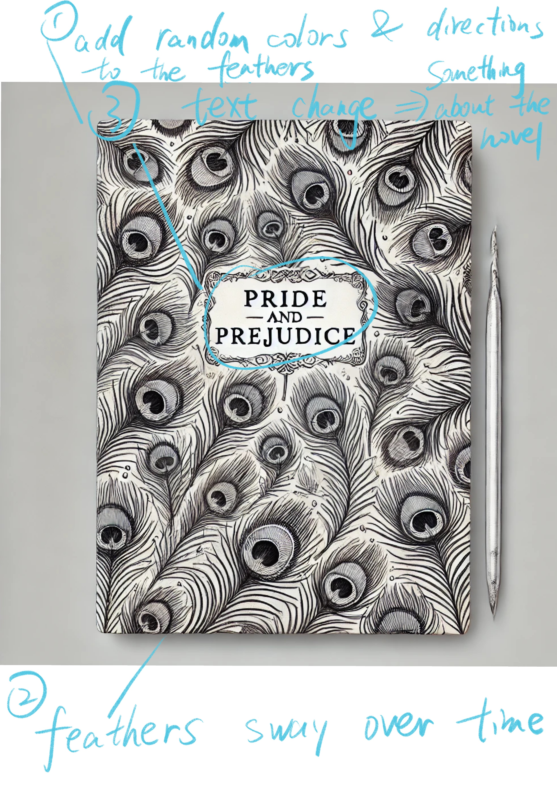

# Milestone3
## What I’ve done this week 
This week, I focused on refining my Pride and Prejudice interactive project. Here’s what I accomplished:

1. **Font Selection for Title**: I downloaded a beautiful, elegant, vintage-inspired font called Great Vibes from Google. This font adds a classic, romantic feel to the project and is perfect for the cover’s title, capturing the essence of Pride and Prejudice.

2. **Feather Animation Enhancement**: Based on feedback from my professor, I added random rotation to each feather image. Now, each feather rotates at a unique angle, making the animation feel more dynamic and natural, as if the feathers are floating and drifting with gentle movement.

3. **Mouse Interactivity for Quotes**: As planned, I implemented mouse interactivity, where clicking on the screen cycles through classic quotes from Pride and Prejudice. Each click reveals a different line from the novel, allowing the viewer to experience a rotating selection of the book’s wisdom and wit.

## Description of the final interactivity or time-based logic
In the final project, viewers will experience a visually dynamic and interactive display inspired by Pride and Prejudice. Key features include:

1. **Floating Feathers Animation**: The background animation consists of gently moving and rotating peacock feathers, symbolizing the elegance and romanticism of the story. Each feather floats across the screen at varying sizes, speeds, and angles, creating a sense of gentle motion and visual depth.

2. **Time-Based Text Animation**: The title "Pride and Prejudice" is displayed prominently in the center of the screen using the Great Vibes font, pulsing slightly to create a subtle, eye-catching effect. The timing of this animation helps draw focus to the central theme.

3. **Mouse Click Interactivity for Quotes**: Each time the user clicks on the screen, a classic quote from Pride and Prejudice appears near the bottom. This interactivity invites viewers to engage with the text actively, as each quote offers insight or a famous line from the story. The quotes alternate with each click, providing a new experience with each interaction.

This combination of animated visuals and interactive text creates an immersive, time-based representation of Pride and Prejudice, blending movement and interactivity to capture the timeless elegance and depth of the novel.
## Images, drawings, sketches

# Milestone2
## What I've done this week
Find a suitable peacock feather material, export to png, then import to vscode.
## Description of the files, classes, objects or arrays  will use
Referring to WK06-2. I used `Array` `for()` `if()`.
## Description of any interactivity or time-based logic
Feathers change based on time
## What will write next step
1. Randomly change the orientation of the feathers; 
2. Add text.

# Mid Term Proposal
## What Book
The book i choose is *Pride and Prejudice by Jane Austin*.
It is a classic novel that explores the themes of love, 
marriage, class, and social expectations in early 19th-century 
England. The story centers around the intelligent and 
strong-willed Elizabeth Bennet and her evolving relationship 
with the wealthy but aloof Mr. Darcy.

 

## What aspect of the book will I include in my cover
I'll be designing some peacock feathers for my cover.
The peacock serves as a symbol of vanity and beauty, that resonate 
with the characters' personal journeys throughout the novel. 
The feathers will be animated.

## Is it interactive? Time-based? Both?/What ideas I'd like to explore or experiment with
The cover will be interactive. The peacock feathers will change over time and 
I wanted to explore how interactivity could be used to visually represent
 the themes of the novel, such as vanity, love and social dynamics. 
 By using mouse events, I hope to capture the fluidity of the characters' 
 emotions. I hope to create text that will represent time and change in 
 the story.

## Are there aspects of your project that are related to any of the readings we’ve done?
My project will draw inspiration from Chapter 28 of The Art of 
Interactive Design by Chris Crawford, which discusses interactive 
storytelling. The chapter emphasizes creating dynamic experiences 
that allow users to engage with the story on a deeper level. 
By applying these concepts, I aim to create an interactive book 
cover for Pride and Prejudice that invites users to explore its 
themes through animation and interactivity.

## Sketch
