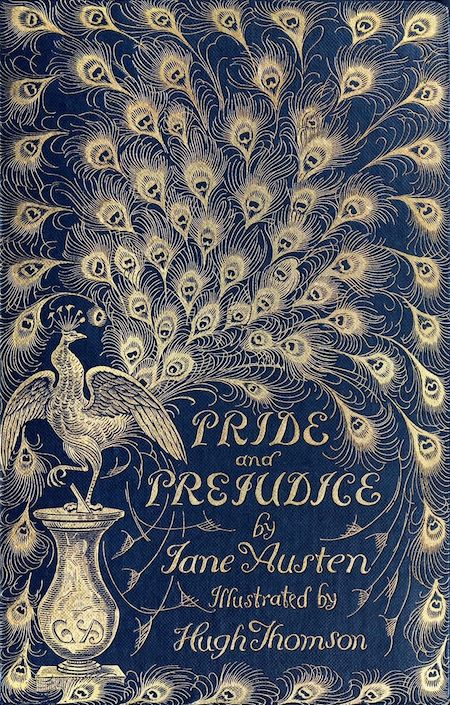

# Mid Term Proposal
## what I've done this week
在Procreate上画出羽毛，导出png，然后导入vscode
## description of the files, classes, objects or arrays  will use
您将使用的文件、类、对象或数组的描述
参考WK06-2
## description of any interactivity or time-based logic
羽毛基于时间变化
## what will write next step
1.随机改变羽毛的朝向;添加文字

## What Book
The book i choose is *Pride and Prejudice by Jane Austin*.
It is a classic novel that explores the themes of love, 
marriage, class, and social expectations in early 19th-century 
England. The story centers around the intelligent and 
strong-willed Elizabeth Bennet and her evolving relationship 
with the wealthy but aloof Mr. Darcy.

 

## What aspect of the book will I include in my cover
I'll be designing some peacock feathers for my cover.
The peacock serves as a symbol of vanity and beauty, that resonate 
with the characters' personal journeys throughout the novel. 
The feathers will be animated.

## Is it interactive? Time-based? Both?/What ideas I'd like to explore or experiment with
The cover will be interactive. The peacock feathers will change over time and 
I wanted to explore how interactivity could be used to visually represent
 the themes of the novel, such as vanity, love and social dynamics. 
 By using mouse events, I hope to capture the fluidity of the characters' 
 emotions. I hope to create text that will represent time and change in 
 the story.

## Are there aspects of your project that are related to any of the readings we’ve done?
My project will draw inspiration from Chapter 28 of The Art of 
Interactive Design by Chris Crawford, which discusses interactive 
storytelling. The chapter emphasizes creating dynamic experiences 
that allow users to engage with the story on a deeper level. 
By applying these concepts, I aim to create an interactive book 
cover for Pride and Prejudice that invites users to explore its 
themes through animation and interactivity.

## Sketch
